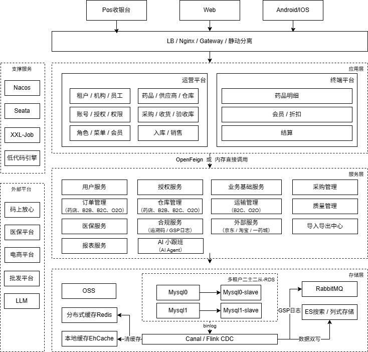
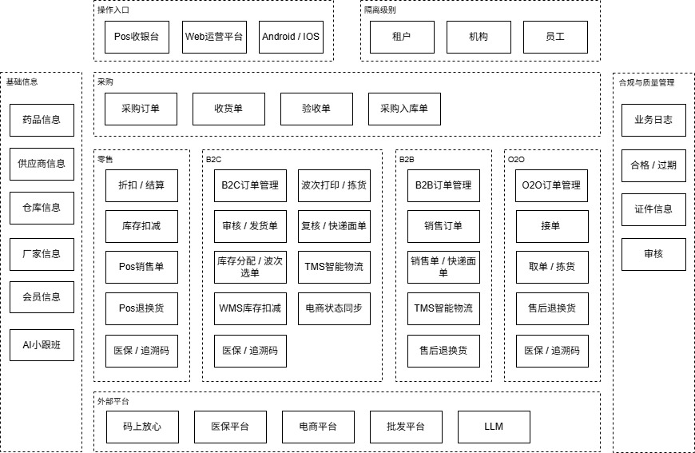
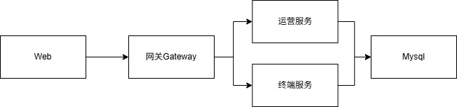
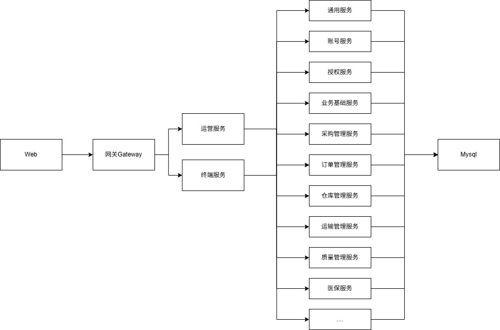
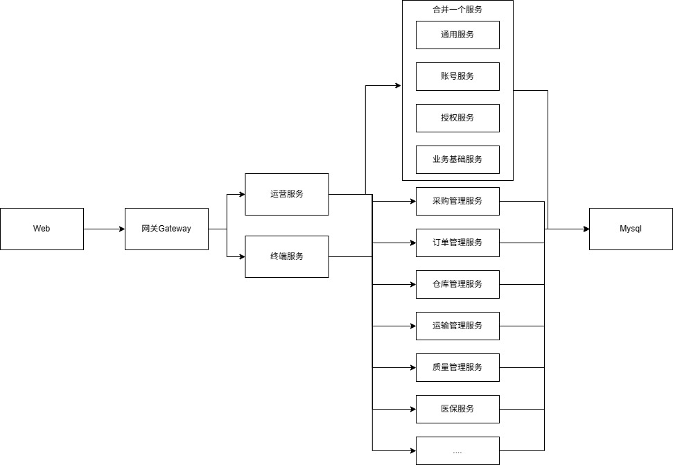

# 医药流通ERP SaaS系统
## 一、描述
一个面向多租户医药流通ERP SaaS，基于 Spring Cloud 微服务 + Vue 构建，数据隔离模型为 **租户 → 机构 → 员工**，支持连锁药店、B2B、B2C、O2O业务。
> 本项目大部分业务功能由 **Claude Code** 完成开发，后端分层与接口规范沉淀于 Skill `springboot-code-standard`（`.claude/skills/`）
## 二、总技术架构图


### 技术栈版本
> 版本统一在 `adrug-parent/pom.xml` 的 `<properties>` + `<dependencyManagement>` 中声明，子模块引用依赖不写版本号。

### 架构分层说明

| 层 | 定位 | 调用链 |
|---|---|---|
| 接入客户端 | Vue / Android / iOS / PDA | → 网关 |
| 网关 `adrug-gateway` | 路由、鉴权、限流 | → 应用层 |
| 应用层 `adrug-app` | 编排业务流程，**不写具体业务逻辑** | `Controller → Service → Rpc → Feign` |
| 服务层 `adrug-svc` | 领域服务，处理服务内部逻辑 | `Controller → Service → Repository → Mapper` |
| 数据层 | MySQL | — |

---

## 三、总业务架构图



## 四、运行效果

## 五、项目结构

```text
DrugSaaS
├─ pom.xml                        # 根聚合工程 (adrug-saas)，parent 指向 adrug-parent
├─ adrug-parent/                  # 通用父模块：统一版本与依赖管理
│
├─ adrug-common/                  # 通用模块（pom 聚合）
│  ├─ adrug-common-model          #   通用实体类
│  ├─ adrug-common-core           #   通用逻辑（切面等）
│  ├─ adrug-common-anno           #   通用注解
│  ├─ adrug-common-mq             #   通用 MQ
│  ├─ adrug-common-redis          #   通用 Redis
│  ├─ adrug-common-db             #   通用数据源（含 MyBatis 依赖）
│  ├─ adrug-common-cache          #   通用缓存
│  ├─ adrug-common-oss            #   通用 OSS（预留）
│  └─ adrug-common-all            #   通用模块聚合
│
├─ adrug-svc/                     # 服务层（pom 聚合）
│  ├─ adrug-svc-user/             #   用户服务
│  │  ├─ adrug-svc-user-info/     #     账号 / 租户 / 机构 / 员工信息
│  │  └─ adrug-svc-user-auth/     #     认证鉴权
│  ├─ adrug-svc-common/           #   通用服务（菜单等，非业务）
│  ├─ adrug-svc-bus/              #   业务服务
│  │  ├─ adrug-svc-bus-common/    #     业务通用逻辑（字典等）
│  │  ├─ adrug-svc-bus-info/      #     基础信息（商品 / 供应商 / 厂家 / 仓库）
│  │  ├─ adrug-svc-bus-pms/       #     采购管理
│  │  ├─ adrug-svc-bus-oms/       #     订单管理
│  │  ├─ adrug-svc-bus-wms/       #     仓库管理
│  │  └─ adrug-svc-bus-tms/       #     运输管理
│  ├─ adrug-svc-gsp/              #   医药行业 GSP
│  │  ├─ adrug-svc-gsp-compliance #     GSP 合规
│  │  └─ adrug-svc-gsp-insurance  #     医保服务
│  └─ adrug-svc-ext/              #   扩展服务
│     └─ adrug-svc-ext-iexport    #     导入导出
│
├─ adrug-app/                     # 应用层（pom 聚合），编排业务流程
│  ├─ adrug-app-oper/             #   运营管理（service + boot）
│  └─ adrug-app-term/             #   终端接入（service + boot）
│
├─ adrug-gateway/                 # API 网关（含主类 + spring-cloud-starter-gateway）
├─ adrug-web/                     # 前端（Vue 3 + Vite + Element Plus）
├─ docs/                          # 需求文档（来自语雀知识库导出）
└─ sql/                           # 建表 SQL（每表一个 .sql，如 employee.sql）
```

> **服务层四层拆分**：`adrug-svc` 下每个领域服务（如 `adrug-svc-bus-info`）内部再按依赖倒置拆分为
> `-interface`（OpenFeign 接口）、`-model`（对外实体）、`-repository`（数据源）、`-provider`（Controller + 实现）四个子模块。
> `adrug-app` 模块不按此四层分层，而采用 `Controller → Service → Rpc → Feign` 编排链。

---

## 六、部署方式

系统采用**横纵向可拆可合**的服务架构设计，同时支持 **Koupleless 模块化热更新**部署：

- **横向拆分**：按「层」拆分 —— 网关 / 应用层 / 服务层可独立部署。
- **纵向拆分**：按「领域」拆分 —— 用户 / 通用 / 业务 / GSP / 扩展各服务可独立部署。
- **可拆可合**：任意服务可按需**合并为一个进程**或**拆分为多个进程**，灵活适配不同规模与团队。

### 1、单点快速部署

将所有服务打包为**单个可执行 JAR**，一个进程启动全部功能，通过「组合启动」（`adrug-boot-all` 思路）合并所有 `-provider` 为一个 Spring Boot 应用。

- 优点：部署简单、占用资源少、无需服务注册发现。
- 适用：本地开发、演示环境、单店 / 小规模试点。


### 2、简单多服务部署

将系统拆分为**少数几个进程**（如 2~3 个 JAR）：

- 网关（`adrug-gateway`）
- 应用层（`adrug-app-oper` + 服务层 ）
- 应用层（`adrug-app-term` + 服务层 ）
- 适用：小连锁、资源受限环境，兼顾一定隔离与易运维，同时不用考虑分布式事务的情况。



### 3、简单层级部署

按「层」部署，服务层再按**业务大类**合并：

- 网关独立
- 应用层独立
- 服务层独立
- 适用：小连锁、资源受限环境，兼顾一定隔离与易运维。
  
  

### 4、细分微服务部署方式

每个领域服务**独立进程**部署，通过 **Nacos** 注册发现 + **OpenFeign** 调用：
- 每个服务独立部署
- 优点：独立扩缩容、独立发布、故障隔离。
- 适用：大型连锁 / 多租户高并发场景。
  
  

### 5、服务层部分服务合并部署方式（特别推荐）

**横纵向混合**部署，按实际负载与团队规模灵活裁剪：

- 将**访问量低、变更少、耦合紧密**的服务合并。
- **高频 / 核心**服务保持独立。
- 优点：独立扩缩容、独立发布、故障隔离、更少硬件资源开销。
- 适用：大型连锁 / 多租户高并发场景。


---

## 七、探讨方式
欢迎交流探讨，当前项目仅用于个人学习，无法直接用于生产环境。

- 📧 邮箱：[954196064@qq.com](mailto:954196064@qq.com)
